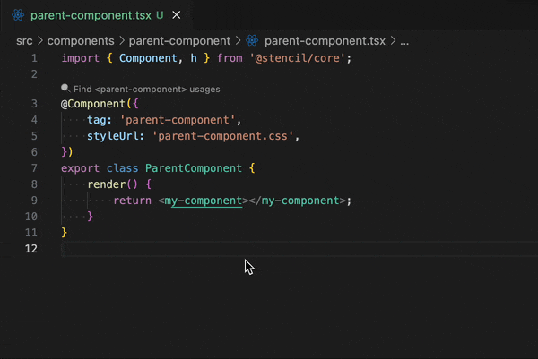
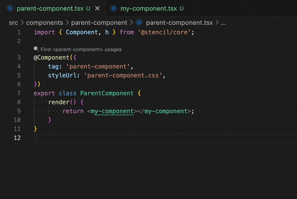
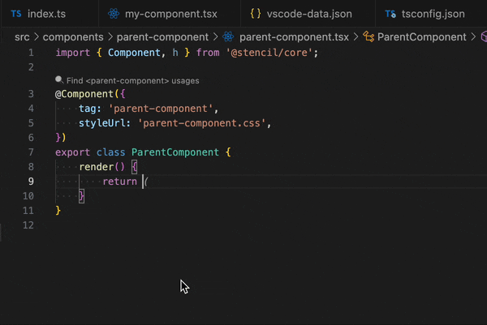
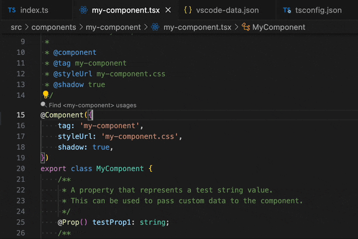

# Stencil Navigator

A VS Code extension that provides:

- **Go to Definition** for Stencil components by clicking on their tags.
- **Hover** tooltips showing component descriptions.
- **IntelliSense** for tags, props, events, methods and slots.
- **CodeLens** “🔍 Find `<tag>` usages” scanning your workspace.
- **Commands & Keybindings** to reload tags, regenerate metadata, show welcome panel, and find usages.

---

## 📦 Installation

1. Install from the [VS Code Marketplace](https://marketplace.visualstudio.com/items?itemName=ViktorPancheliuha.stencil-navigator).
2. Or clone repo and press `F5` in VS Code to run in Extension Development Host.

## 🚀 Quick Start

1. Open a Stencil project in VS Code.
2. Wait for the status bar item **Stencil Navigator** to appear.
3. In any `.tsx` or HTML file, hover over `<my-tag>` to see its doc.
4. Click on a tag or press `F12` on it to jump to its definition.
5. Click the CodeLens “🔍 Find `<my-tag>` usages” above your component class to see all usages.

---

# Usage Guide

## 1. Go to Definition

- Hover over any custom tag, e.g. `<my-component>`.
- **F12** or **Ctrl+Click** on the tag name to jump to its Stencil source file.



## 2. Hover Tooltips

- Hover displays component description from JSDoc above the class.

```html
<my-component>
      ^ hover here
```



## 3. IntelliSense

- Type `<` and start typing a tag to see component suggestions.
- Inside a tag, after a space, props/events/methods/slots are suggested.

```jsx
<my-component  // triggers props completion
```



## 4. Find Usages (CodeLens)

- Open a Stencil source file.
- Above the `@Component({ tag: 'my-component' })` line you’ll see:

  ```
  🔍 Find <my-component> usages
  ```

- Click to scan your workspace and open the References view.



---

_For advanced configuration see [CONFIGURATION](./docs/CONFIGURATION.md)._

---

## 🛠️ Configuration

| Setting                                   | Default    | Description                                          |
|-------------------------------------------|------------|------------------------------------------------------|
| `stencilNavigator.filePatterns`           | `["src/components/**/*.tsx"]` | Glob patterns to include when scanning files.        |
| `stencilNavigator.excludePatterns`        | `["node_modules/**","dist/**"]` | Glob patterns to exclude from scan.                  |
| `stencilNavigator.dataSaveLocation`       | `"extensionStorage"` | Where to write `vscode-data.json` (`projectRoot` or `extensionStorage`). |
| `stencilNavigator.completionTriggers`     | `[" ","<","/"]` | Characters that trigger prop/event/slot completions. |
| `stencilNavigator.sortPrefix`             | `"0"`      | Prefix to enforce sorting of tag vs props.           |
| `stencilNavigator.features`               | **all on** | Enable or disable specific features (see docs).      |

You can create a `stencil-navigator.config.json` in your project root:

```jsonc
{
  "filePatterns": [
    "src/components/**/*.tsx",
    "src/pages/**/*.{tsx,jsx,html}"
  ],
  "excludePatterns": [
    "node_modules/**",
    "dist/**"
  ],
  "dataSaveLocation": "extensionStorage",
  "completionTriggers": [" ", "<", "/"],
  "sortPrefix": "0",
  "features": {
    "definition": true,
    "hover": true,
    "completion": true,
    "links": true,
    "findUsages": true,
    "welcomePanel": true,
    "enterTrigger": true
  }
}
```

See [CONFIGURATION](./docs/CONFIGURATION.md) for full details.

## 🎛️ Commands & Keybindings

| Command                        | Keybinding                 |
|--------------------------------|----------------------------|
| **Reload Tags**                | `Ctrl+Shift+P` → Reload Tags         |
| **Generate vscode‑data.json**  | `Ctrl+Shift+P` → Generate Data       |
| **Welcome Panel**              | `Ctrl+Shift+P` → Welcome             |
| **Find Usages** (CodeLens)     | click “🔍 Find `<tag>` usages”       |

## 🤝 Contributing

See [CONTRIBUTING](./docs/CONTRIBUTING.md)

---

*Enjoy navigating your Stencil components!*
