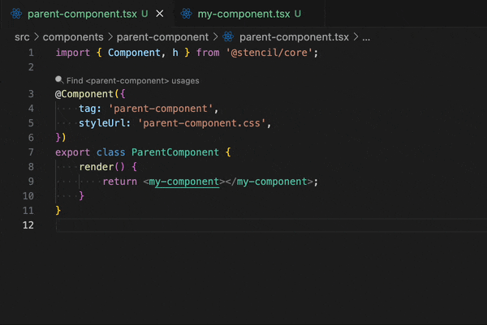
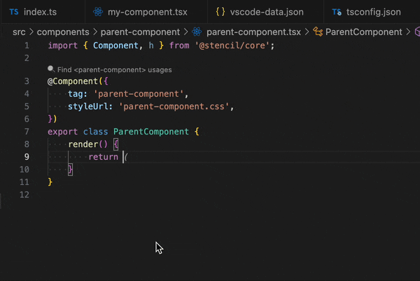

# Usage Guide

## 1. Go to Definition

- Hover over any custom tag, e.g. `<my-component>`.
- **F12** or **Ctrl+Click** on the tag name to jump to its Stencil source file.


## 2. Hover Tooltips

- Hover displays component description from JSDoc above the class.

```html
<my-component>
      ^ hover here
```



## 3. IntelliSense

- Type `<` and start typing a tag to see component suggestions.
- Inside a tag, after a space, props/events/methods/slots are suggested.

```jsx
<my-component  // triggers props completion
```



## 4. Find Usages (CodeLens)

- Open a Stencil source file.
- Above the `@Component({ tag: 'my-component' })` line you’ll see:

  ```
  🔍 Find <my-component> usages
  ```

- Click to scan your workspace and open the References view.


---

_For advanced configuration see [CONFIGURATION](../docs/CONFIGURATION.md)._
